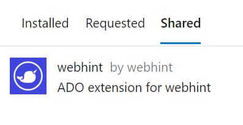
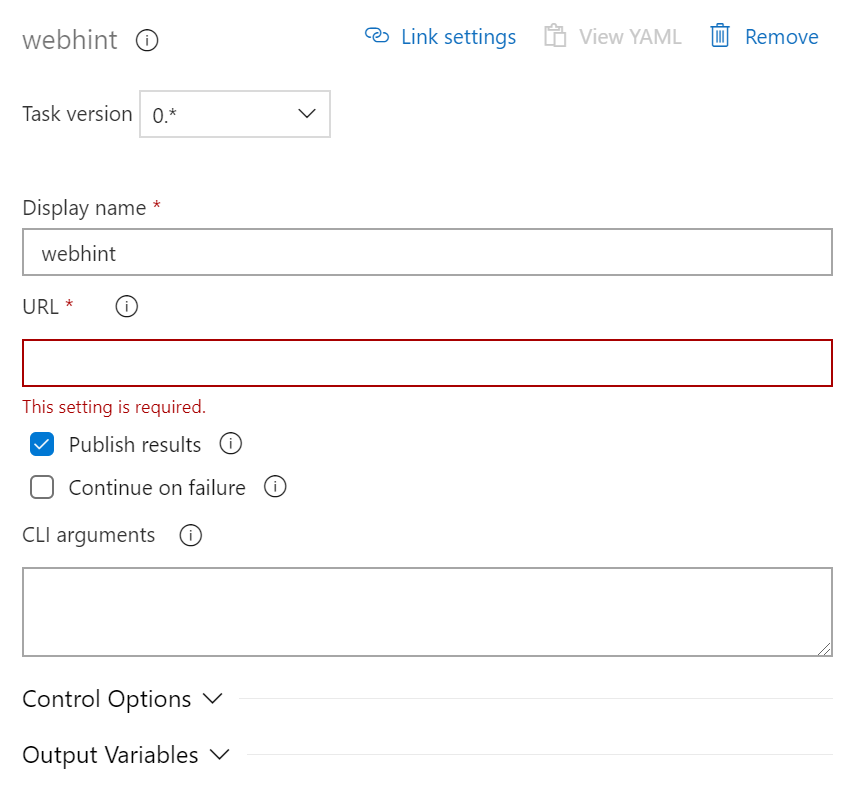

# Introduction

[webhint](https://webhint.io/) Azure pipelines task implementation.

# How to use it?

**Note:** The extension is not available publicly yet. If you want to help us
beta test please open an issue with the name of you Azure DevOps
organization and we will give you access.

**Note:** The extension will use the locally installed version of webhint in
your project. If none is found, it will run `npx hint https://URL`.
It will also use your local `.hintrc` to decide what hints to run or use the
default configuration if there is not one (or if it is not valid).

1. Go to your Azure DevOps organization settings' page:
   https://dev.azure.com/\<ORGANIZATION\>/_settings/extensions?tab=shared

1. Select webhint from the list:

   

1. Click on "Install" and follow the instructions:

    

1. Use the visual editor to modify the Pipeline where you want to add the task,
   search for "webhint" and "Add" it:

    

1. Fill the options and save the changes:

    

1. The task should run the next time the Pipeline is executed.

# How to develop and test the extension?

## Prerequirements

If you are going to publish to the `webhint` ADO organization you will need
permissions to publish to the marketplace and a Personal Access Token. LINK TO DOCUMENTATION

If you want to test this in your own organization, you will have to modify
the `publisher` in `vss-extension.json` and the `id` in `/src/task/task.json`
to another GUID (and any references to the previous value).

## Getting ready

1. Clone repository
1. Install dependencies via `npm`:

   `npm install`

1. Build the assets:

   `npm run build`

   This will create a new folder `dist` with all the necessary files. The
   project uses `webpack` to bundle (most of) the dependencies so you should
   end up with a relatively large `dist/task/execute-webhint.js` file.

1. Create the extension:

   `npm run create-extension`

   A new file `webhint-webhint-devops-x.x.x.vsix` will be created in the root.

1. When you are ready to publish, run:

   `npm run publish`

   This command will run the commands above and automatically publish to the
   Marketplace.
